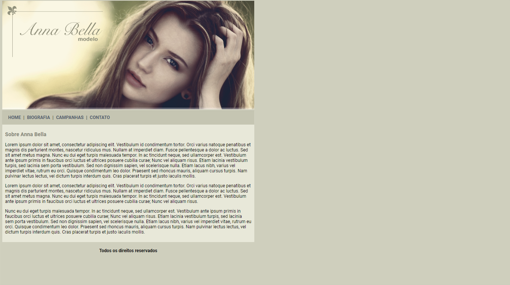

# PROJETO ANNA BELLA MODELO 

> Curso Udemy CSS 3

Bom, nesse projeto foi a introdução do CSS no HTML, foi meu primeiro toque com o CSS e foi ai que percebi que gostava, mesmo que esse projeto seja feio que doi so de ver. 

## 📚 O que foi ensinado 
- CSS INTERNO e EXTERNO
- Inline
- Seletores
- Class e Id
- Tags - Divs - Span
- Bordas
- Formatação de Textos (cores, fontes, tamanhos)
- Background (cor e imagem)